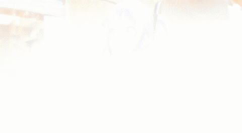

# harmonize

Replace a real person in ordinary video footage with a flat 2D anime reference
character — consistently, frame to frame — while leaving the rest of the shot
untouched. Built on [SCAIL-2](https://github.com/zai-org/SCAIL-2) in
replacement mode.

<table>
<tr>
<td><br><a href="assets/demo/miku_airport.mp4">full-quality mp4</a></td>
<td><br><a href="assets/demo/miku_street.mp4">full-quality mp4</a></td>
</tr>
</table>

## Why SCAIL-2

Three approaches were evaluated for this project:

| Approach | Verdict |
|---|---|
| PISCO (sparse-keyframe insertion/harmonization) | Good quality, but an insertion tool rather than an autonomous character animator — doesn't handle arbitrary motion well. |
| Wan2.2-Animate-14B, replacement mode | Works reliably, but renders the character as photoreal/CG-blended rather than flat 2D anime. |
| **SCAIL-2, replacement mode** | **Chosen.** Clean flat cel-shaded output, no pose/skeleton intermediate needed, handles long sequences via native chunking. |

## Pipeline

```
reference character image  ─┐
                             ├─▶  SCAIL-2 (generate.py --replace_flag)  ─▶  output video
real driving video          ─┘         (character replaces the person,
                                         background regenerated natively)
```

Concretely, per clip:

1. **Reference character**: a flat illustration of the character, with a
   silhouette mask. If the illustration's aspect ratio doesn't roughly match
   the driving video's orientation, pad it with a plain background to the
   target aspect first — otherwise SCAIL-2's internal resize/crop step will
   orient to the *reference image's* aspect ratio and heavily crop the
   driving footage.
2. **Driving video**: a short (~2-3s) real clip with one continuous shot (no
   mid-clip scene cuts) of the person to be replaced.
3. **Replacement mask**: a per-frame binary mask of the person in the driving
   video. The official pipeline generates this via `SCAIL-Pose`'s
   `process_replacement.py`, which requires SAM3 (gated on Hugging Face). As
   a fallback that needs no gated access, a
   [SAM2](https://github.com/facebookresearch/sam2) point-prompt video
   tracker works well — seed a point on a representative frame (not frame 0,
   which SCAIL-2 sometimes renders as a washed-out artifact) and propagate in
   both directions.
4. **Generation**: `generate.py --replace_flag --sample_steps 40`, no
   relighting LoRA (it pulls the character toward the "realistic lighting"
   look this project is explicitly trying to avoid). The direct model output
   is the system's output — no further background compositing.

We tried compositing the generated character back onto the pixel-exact
original background (to guarantee the background is untouched), but the
generated character's silhouette doesn't line up with the real person's
original silhouette, and stitching the two masks together introduced visible
seams. The raw SCAIL-2 output already keeps the background close to the
source and looks better in practice.

## Setup

```bash
git clone -b wan-scail2 https://github.com/zai-org/SCAIL-2.git vendor/SCAIL-2
cd vendor/SCAIL-2
uv pip install -r requirements.txt
hf download zai-org/SCAIL-2 --local-dir checkpoints
python convert.py --scail-dir checkpoints --save-path converted/SCAIL-2.safetensors
```

Two patches are needed on top of the vendored `wan-scail2` branch as of this
writing (check whether upstream has since fixed either before reapplying):

- `convert.py`: `torch.load()` needs `weights_only=False` (torch defaults to
  `True`, which rejects a numpy global inside the official checkpoint).
- `generate.py`: a `dist.init_process_group(...)` call is left commented out
  upstream; multi-GPU (`--dit_fsdp --t5_fsdp`) doesn't work without it.

A single modern GPU (~100GB+ VRAM) runs the 14B model comfortably without
FSDP/multi-GPU sharding.

## Running a replacement job

```bash
python generate.py \
    --model SCAIL-14B \
    --ckpt_dir vendor/SCAIL-2/checkpoints \
    --scail_path vendor/SCAIL-2/converted/SCAIL-2.safetensors \
    --target_w 1280 --target_h 704 \
    --image path/to/character_ref.png \
    --mask_image path/to/character_ref_mask.png \
    --pose path/to/driving_video.mp4 \
    --mask_video path/to/replacement_mask.mp4 \
    --sample_steps 40 \
    --prompt "A description of the finished shot, not an editing instruction." \
    --save_file output.mp4 \
    --replace_flag
```

The prompt should describe the completed scene (character's appearance,
setting, what's happening) — not an instruction like "replace the person
with...".

## Known limitations

- Reference images that are extreme aspect-ratio outliers relative to the
  driving footage still cause heavy cropping even after padding; pad toward
  the driving video's actual aspect ratio, not just "landscape vs portrait".
- Generated frame 0 is sometimes a washed-out artifact of the model itself;
  not fixable by better inputs.
- Occasional hallucinated on-screen text/logo artifacts (the model attempting
  to reproduce text it inferred from the driving footage) — cosmetic, no
  known fix yet.
- Background is regenerated by the model, not preserved pixel-for-pixel — for
  most shots it stays close to the source, but don't rely on it for exact
  background fidelity.
